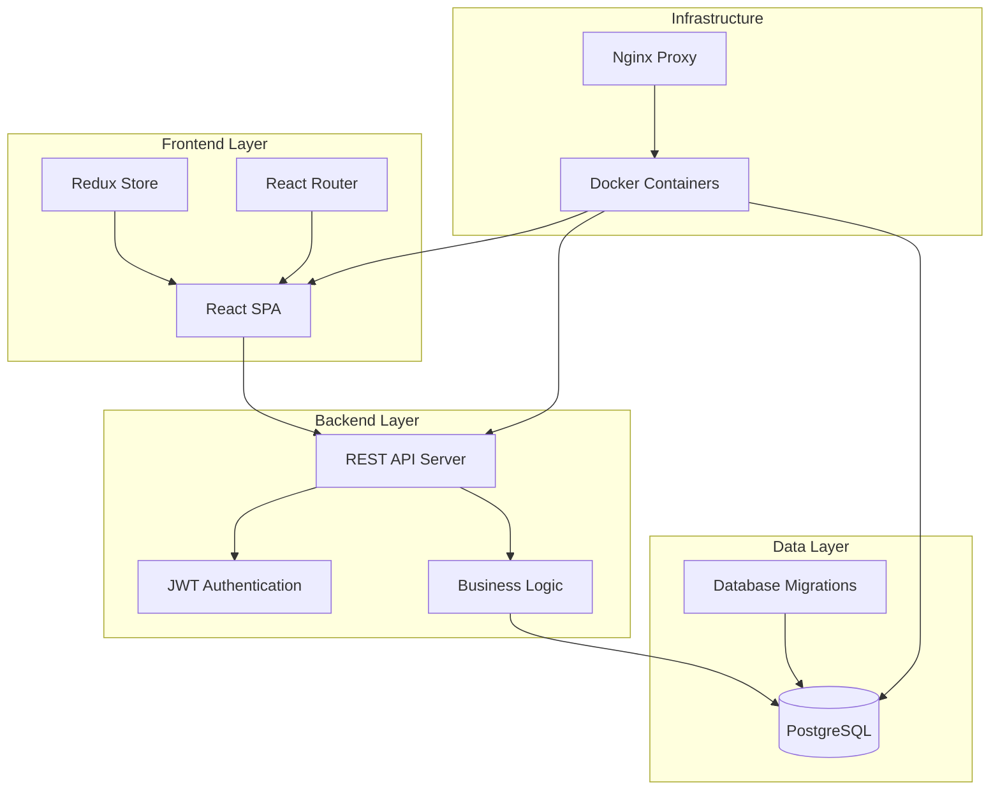

# 👑 MR.KINGSMAN

> Современная платформа для управления магазинами мужской одежды с программой лояльности и интегрированным каталогом товаров

<div align="center">


</div>

## 📋 Описание

**MR.KINGSMAN** — это полнофункциональная веб-платформа для управления сетью магазинов мужской одежды премиум-класса. Система предоставляет комплексное решение для управления каталогом товаров, обработки заказов, программы лояльности клиентов и аналитики продаж.

**Целевая аудитория:**
- 🏪 Владельцы и менеджеры розничных магазинов
- 👥 Клиенты магазинов мужской одежды
- 📊 Администраторы и аналитики

## ✨ Основные возможности

### Для клиентов
- 🛒 **Каталог товаров** — удобный поиск и фильтрация по категориям
- 🛍️ **Корзина покупок** — добавление товаров и управление заказами
- 💳 **Программа лояльности** — накопление баллов и получение скидок
- 📱 **QR-код профиля** — быстрая идентификация в магазине
- 🔔 **Уведомления** — персональные предложения и новости
- 📍 **Карта магазинов** — поиск ближайших точек продаж

### Для администраторов
- 📊 **Панель управления** — контроль продаж и аналитика
- 📦 **Управление товарами** — добавление, редактирование каталога
- 👥 **Управление клиентами** — просмотр профилей и истории покупок
- 🏪 **Управление магазинами** — информация о точках продаж
- 💰 **Финансовая отчетность** — анализ доходов и прибыли

## 🏗️ Архитектура проекта



### Компоненты системы

| Компонент | Технология | Назначение |
|-----------|------------|------------|
| **Frontend** | React 19+ | Пользовательский интерфейс |
| **Backend API** | Go 1.23+ | REST API и бизнес-логика |
| **База данных** | PostgreSQL 15 | Хранение данных |
| **Прокси** | Nginx | Маршрутизация запросов |
| **Контейнеризация** | Docker | Развертывание и масштабирование |

## 🛠️ Технологии

<table>
<tr>
<td width="50%">

### Backend
- **Go 1.23.2** — основной язык
- **Chi Router** — HTTP маршрутизация
- **PostgreSQL** — база данных
- **JWT** — аутентификация
- **bcrypt** — хеширование паролей
- **golang-migrate** — миграции БД

</td>
<td width="50%">

### Frontend
- **React 19.1.1** — UI фреймворк
- **Redux Toolkit** — управление состоянием
- **React Router** — маршрутизация
- **Axios** — HTTP клиент
- **React Icons** — иконки
- **CSS3** — стилизация (без Tailwind)

</td>
</tr>
</table>

### DevOps & Инструменты
- 🐳 **Docker & Docker Compose** — контейнеризация
- 🔄 **Air** — hot reload для Go
- 🗃️ **pgAdmin** — управление БД
- 📝 **Golang Migrate** — миграции
- 🔧 **Nginx** — веб-сервер и прокси

## 🚀 Установка и запуск

### Предварительные требования

- **Docker** версии 20.10+
- **Docker Compose** версии 2.0+
- **Git** для клонирования репозитория

### Быстрый старт

1. **Клонирование репозитория**
   ```bash
   git clone https://github.com/username/kingsman.git
   cd kingsman
   ```

2. **Запуск в продакшн режиме**
   ```bash
   docker-compose up -d
   ```

3. **Доступ к приложению**
   - 🌐 **Frontend**: http://localhost:3000
   - 🔧 **Backend API**: http://localhost:8080
   - 🗃️ **pgAdmin**: http://localhost:5050
     - Email: `admin@kingsman.com`
     - Password: `admin123`

### Разработка

1. **Запуск в режиме разработки** (с hot reload)
   ```bash
   docker-compose -f docker-compose.dev.yml up -d
   ```

2. **Просмотр логов**
   ```bash
   docker-compose logs -f
   ```

3. **Остановка сервисов**
   ```bash
   docker-compose down
   ```

### Конфигурация

Настройки находятся в файле `backend/app/.env`:

```env
# Database
DB_HOST=database
DB_PORT=5432
DB_USER=postgres
DB_PASSWORD=a6fbnmod
DB_NAME=kingsman
DB_SSLMODE=disable

# Server
PORT=8080
JWT_SECRET=your_secret_key
```

## 📖 Примеры использования

### REST API Примеры

#### Регистрация пользователя
```bash
curl -X POST http://localhost:8080/users/register \
  -H "Content-Type: application/json" \
  -d '{
    "email": "user@example.com",
    "password": "password123",
    "first_name": "Иван",
    "last_name": "Петров"
  }'
```

#### Авторизация
```bash
curl -X POST http://localhost:8080/users/login \
  -H "Content-Type: application/json" \
  -d '{
    "email": "user@example.com",
    "password": "password123"
  }'
```

#### Получение каталога товаров
```bash
curl -X GET http://localhost:8080/products \
  -H "Authorization: Bearer YOUR_JWT_TOKEN"
```

#### Добавление товара в корзину
```bash
curl -X POST http://localhost:8080/cart/add \
  -H "Authorization: Bearer YOUR_JWT_TOKEN" \
  -H "Content-Type: application/json" \
  -d '{
    "product_id": 1,
    "quantity": 2
  }'
```

### Интерфейс пользователя

#### Мобильная навигация
- 📱 **Бургер-меню** — расположено в левом верхнем углу
- 🎯 **Выдвижное меню** — плавная анимация слева
- 🔄 **Адаптивный дизайн** — корректная работа на всех устройствах

#### Программа лояльности
- 💎 **Система уровней** — Bronze, Silver, Gold, Platinum
- 🎁 **Накопление баллов** — за каждую покупку
- 🏷️ **Скидочная карта** — персональная карта клиента
- 📱 **QR-код** — для быстрой идентификации

## 🗄️ Структура базы данных

<details>
<summary>Основные таблицы</summary>

```sql
-- Пользователи
CREATE TABLE users (
    id SERIAL PRIMARY KEY,
    email VARCHAR(255) UNIQUE NOT NULL,
    password_hash VARCHAR(255) NOT NULL,
    first_name VARCHAR(100),
    last_name VARCHAR(100),
    created_at TIMESTAMP DEFAULT NOW()
);

-- Товары
CREATE TABLE products (
    id SERIAL PRIMARY KEY,
    name VARCHAR(255) NOT NULL,
    description TEXT,
    price DECIMAL(10,2) NOT NULL,
    category_id INTEGER REFERENCES categories(id),
    image_url VARCHAR(500),
    created_at TIMESTAMP DEFAULT NOW()
);

-- Корзина
CREATE TABLE carts (
    id SERIAL PRIMARY KEY,
    user_id INTEGER REFERENCES users(id),
    created_at TIMESTAMP DEFAULT NOW(),
    is_paid BOOLEAN DEFAULT FALSE
);

-- Программа лояльности
CREATE TABLE loyalty_profiles (
    id SERIAL PRIMARY KEY,
    user_id INTEGER REFERENCES users(id),
    tier VARCHAR(20) DEFAULT 'Bronze',
    points INTEGER DEFAULT 0,
    created_at TIMESTAMP DEFAULT NOW()
);
```

</details>

## 🤝 Контрибьюция

Мы приветствуем участие в развитии проекта! Вот как вы можете помочь:


## 🛡️ Безопасность

- 🔐 **JWT токены** для аутентификации
- 🔒 **bcrypt** для хеширования паролей
- 🛡️ **CORS** защита настроена
- 🔑 **Переменные окружения** для секретов
- 📝 **Валидация входных данных**

